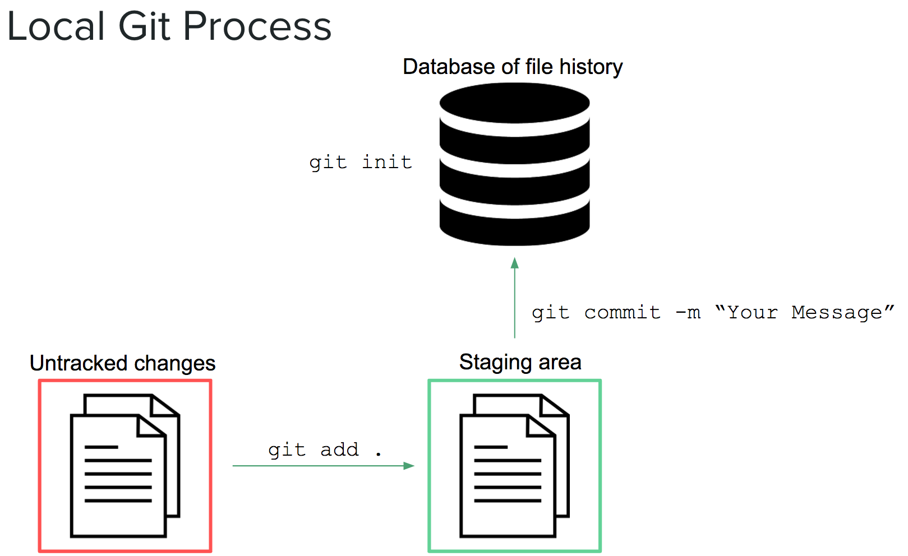
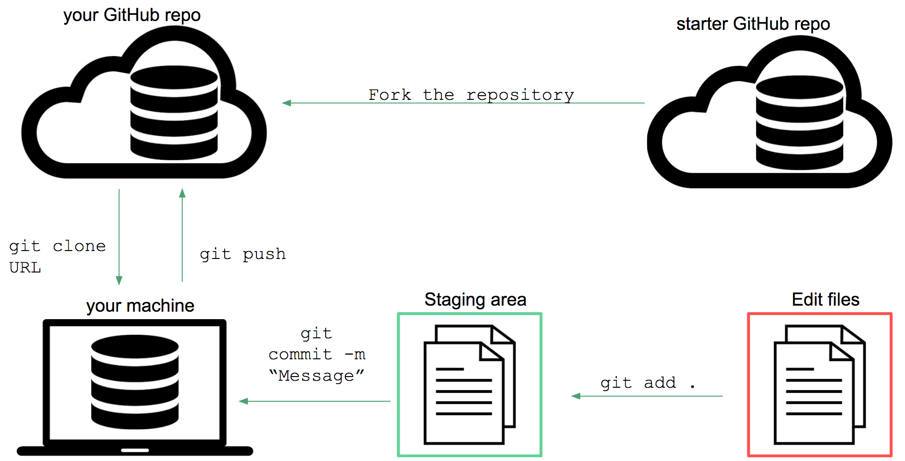

<p align="center"><a href="https://github.com/javedali99/git-tutorial"></a></p>

<h1 align="center">Hands-on Tutorial: Introduction to Git and GitHub </h1>

<h2 align="center">
    <a href="https://javedali99.github.io/git-tutorial/slides.html">📖 Slides</a>
    <br>
</h2>

This tutorial provides an introduction to version control systems using `git` and `GitHub`. It focuses on teaching you the techniques you need to actually get started.

We will use the ⌨️ Command Line Interface (CLI) (i.e. `Bash` for Windows and `Terminal` in Mac) to perform essential command line techniques. 

## Git
`Git` is a free and open-source version control software that provides you with a set of command line tools for tracking changes to your files. 

All of the files in a project directory (referred to as a `repository`, or `repo`) are tracked by a hidden `.git` file in the root of the project.  You can initiate a repository on your local machine with the `git init` command.  

Git allows you to roll back to a previous snapshot of your project called a `commit`.  When you want to take a snapshot of your work, you'll need to `add` your the changes to your files to a **staging area**.  You can think of a staging area (literally) like a staging area.  The changes that you want to be included in your next snapshot need to be put on stage in order to be captured by the `commit`.  Each time you take a snapshot (`commit`), you'll need to include a short message that describes the set of changes.  These steps fit together as follows:



<br>

Here is additional information on each (of these) `git` commands (note, this **_is not_** a full list -- see [documentation](https://git-scm.com/docs)):

| Command  | Function |
| ------------- | ------------- |
| `git init` | Initialize a new repository in the current directory. This creates a database to track file changes, which you **only do once** at the start of a project. |
| `git status`  | Reports any changes to the files in your repo. |
| `git add FILE-NAME` or `git add .`  | Adds a file or files (`.`) to the staging area. All changes to those files will be included in the next commit. |
| `git commit -m "Description"`  | Commits all changes to all files currently in the **staging area** to the repository. This takes a snapshot that you can return to and **must include a message** with `-m`.|

So far, the process described all occurs on your local machine. This is a good practice, but does not facilitate collaboration with others, or create a backup of your code. For these purposes, we'll use **GitHub**.

## GitHub
In order to share our code and collaborate with others, we'll need a publicly accessible (cloud) location where we can store our files (and file _history_) -- that's what GitHub is for.

GitHub is the most popular open-source web-based repository hosting service.  In addition to providing a great UI on top of a server that hosts your repositories, GitHub has a number of additional features such as issue tracking, wiki pages, and notifications that make it a great collaboration tool.  

The important thing to keep in mind is that GitHub doesn't just store the a copy of your code files in your repository -- it stores the **entire database of changes** to the files. This allows other developers to view the files at an earlier point in time.  


## To Get Started

1. Register for an account on [github.com](https://github.com/).

3. Download, install and configure git. 

    - Windows users please install [Git for Windows](https://gitforwindows.org/).
    - Mac users: [Git for MacOS](https://git-scm.com/download/mac) or install it using Homebrew: 

        ```bash
        brew install git
        ```

    
4. Make sure to set Git with your name and email address using the following commands on the command-line with your name and email address:

    ```bash
    # Enter YOUR NAME to set your name
    git config --global user.name "FirstName LastName"
          
    # Enter YOUR EMAIL to set your email. Make sure it is the email associated with your GitHub account!
    git config --global user.email "email@example.com"
    ```
    - Test if this worked by typing 
        
        ```bash
        git config --list
        ```
        
    - This is important because Git will use this information when you work on a project.

>See [this article](https://help.github.com/articles/set-up-git/) for more information on setting up GitHub.

5. **SSH Key generation and setup**
 
    You will need to configure local machine to connect to GitHub using SSH authorization. You will only need to do this once for each local machine (unless GitHub changes things in the future and decides this isn’t secure enough). SSH is a cryptographic network protocol that allows secure communication between computers using an otherwise insecure network. SSH uses what is called a key pair. This is two keys that work together to validate access. One key is publicly known and called the public key, and the other key called the private key is kept private. 
    
    **Step 1:** Check if your computer is already connected to GitHub
    ```bash
    ssh -T git@github.com
    ```
    - Then type your GitHub password (no characters will show up on the screen while you type your password). If it gives an error, then you're not connected.
    
    **Step 2:** Check what key pairs already exist on your computer.
    ```bash
    ls -al ~/.ssh
    ```
    - If SSH has been set up on the computer you’re using, the public and private key pairs will be listed. The file names are either `id_ed25519`/`id_ed25519.pub` or `id_rsa`/`id_rsa.pub` depending on how the key pairs were set up. 
    
    **Step 3:** If they don’t exist on your computer, use this command to create them.
    
    ```bash
    ssh-keygen -t ed25519 -C "your email address"
    ```
    - It is recommended to use the same email you use to connect to your GitHub account. Create default file to save SSH keys: hit Enter when prompted.

    - Add a password if you want, but you will need to remember this password because there might(?) be no way to change it.
    
    - The “identification” is actually the private key. You should never share it. The public key is appropriately named. The “key fingerprint” is a shorter version of a public key.
    
    **Step 4:** Now that we have generated the SSH keys, we will find the SSH files when we check.
    ```bash
    ls -al ~/.ssh
    ```
    
    **Step 5:** Copy the public key to GitHub
    - First, we need to copy the public key. Be sure to include the .pub at the end, otherwise you’re looking at the private key.
    
        ```bash
        cat ~/.ssh/id_ed25519.pub
        ```
    
    - Now, going to GitHub.com, click on your profile icon in the top right corner to get the drop-down menu. 
    - Click “Settings,” then on the settings page, click “SSH and GPG keys,” on the left side “Account settings” menu. 
    - Click the “New SSH key” button on the right side. 
    - Now, give the SSH key a title, such as your name and a way to identify the local machine. 
    - Paste your SSH key into the field, and click the “Add SSH key” to complete the setup.
    
    **Step 6:** Now that we’ve set that up, let’s check our authentication again from the command line.
    
    ```bash
    ssh -T git@github.com
    ```
    - It should say, `Hi <Your Name>! You've successfully authenticated, but GitHub does not provide shell access.`
    <br>

    >Detailed Instructions on SSH: [GitHub instructions for SSH keys](https://docs.github.com/en/authentication/connecting-to-github-with-ssh/generating-a-new-ssh-key-and-adding-it-to-the-ssh-agent) | [Software Carpentry](https://swcarpentry.github.io/git-novice/07-github/index.html#3-ssh-background-and-setup)


## Workflow Example
Here is _one_ example of a workflow you may choose when working with a project. Let's imagine that there's a repository online that you want to use as a starting point for a project. First, you may want **your own cloud copy** of a repository on GitHub. In order to start working on the files, you'll need to get them on your computer (they're still only in the cloud). To do so, you will clone **your repository** to your machine. This will create a local copy of the files **as well as their entire history** on your local machine. We'll use the terminal to clone the repository, but we need to get some information about it first. To get the URL location of the repository, click the **Clone or Download** button, then click on the clipboard icon to copy the URL to your clipboard:

<!--

-->

Then, on your terminal, you could use the `git clone` command described below.  Here is a diagram of the full process:



<br>

Here are additional `git` commands that allow you to interact easily with GitHub:

| Command  | Function |
| ------------- | ------------- |
| `git clone REPO-URL` | Creates a new copy of a source repository, which typically exists on a remote server. Use this when you want to clone down a GitHub repository. This command will create a new subdirectory with the same name as the source repository. |
| `git push origin master`  | Pushes all commits on the `master` branch made since the last push to another repository (`origin`), typically across the network (e.g., to GitHub)  |
| `git pull`  | Pulls all commits made since the last pull from another repository, and attempts to merge those changes into your current files. |
| `git config` | Configure your GitHub account. You should run `git config --global user.name "Your Full Name" and `git config --global user.email your-github-email` to initially set up. |

## Additional resources

How can I learn more about Markdown languages?

- [Here is a great Markdown tutorial](https://commonmark.org/help/tutorial/)
    
- [Here is a quick Markdown guide](https://www.markdownguide.org/basic-syntax/)
