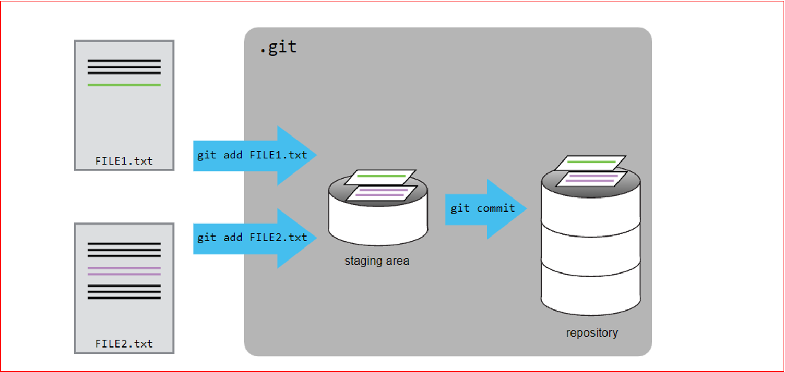

```{r setup, include=FALSE}
options(htmltools.dir.version = FALSE)
library(fontawesome)
library(xaringanExtra)
xaringanExtra::use_panelset()
```

```{r xaringan-themer, include=FALSE, warning=FALSE}
library(xaringanthemer)
style_duo_accent(
  primary_color = "#557571",
  secondary_color = "#d49a89",
  header_font_google = google_font("Montserrat"),
  text_font_google = google_font("Source Sans Pro"),
  code_font_size = "0.8rem",
  link_color = "#d49a89",
)
extra_css <- list(
  ".accent" = list(color = "#d49a89"),
  ".white" = list(color = "#FFFFFF"),
  ".small" = list("font-size" = "30%"),
  ".h4" = list("font-size" = "1.5rem",
               "font-weight" = "600",
               "font-family" = "Montserrat"),
  ".title-slide-custom .remark-slide-number" = list("display" = "none"),
  ".card" = list("position" = "relative",
                 "display" = "inline-block",
                 "margin" = "auto"),
  ".card .img-top" = list("display" = "none",
                          "position" = "absolute",
                          "top" = "0",
                          "left" = "0",
                          "z-index" = "99"),
  ".card:hover .img-top" = list("display" = "inline"),
  ".circle" = list("border-radius" = "50%")
)
style_extra_css(css = extra_css, outfile = "custom.css")
```

class: title-slide-custom, title-slide, middle
background-color: #557571


<div>

</div>

# Hands-on GitHub Tutorial

### Introduction to Git and GitHub

<br><br><br><br><br><br>
.h4[Javed Ali]


Graduate Research Assistant & PhD Student

Dept. of Civil, Environmental & Construction Engineering

University of Central Florida, USA

<br><br>
.h5[(`r format(Sys.Date(), format='%d %B %Y')`)]

<br>
<br>
<br>
<br>
<br>
<br>
<br>

.pull-right[
<br><br><br>
.footnote[Slides:
<a href="https://tinyurl.com/intro-git-slides"><i class="fa fa-github fa-fw"></i>&nbsp; https://tinyurl.com/intro-git-slides</a>
<!-- (adapted from Alice Lépissier's slides) -->
]
]


---
# Has this happened to you?

```{r echo=FALSE, fig.align="center", out.width="50%", fig.cap=""}

```


---


# This tutorial is for you

<br>

.pull-left[
.h4[If you want to get started with Git **now**.]

Here, we will focus on the tools you _actually_ need to start working collaboratively and putting your work under version control.

Git is extremely powerful and there are myriad sophisticated things you can do with it. As a result, the [`r fa("book", fill = "#d49a89")` documentation](https://git-scm.com/book/en/v2) is very thorough, but can often be overwhelming `r emo::ji("exploding_head")` if you are just starting.
]

.pull-right[

]


---
# Why you should use Git 

.h4[To be kind to yourself]

.h4[To be kind to your collaborators]

.h4[To ensure your work is reproducible]

<br>


--
### Spillover benefits

`r emo::ji("man_scientist")` `r emo::ji("ruler")` It imposes a certain discipline to your programming.

`r emo::ji("nerd_face")` `r emo::ji("fire")` You can be braver when you code: if your new feature breaks, you can revert back to a version that worked!

`r emo::ji("coder")` `r emo::ji("box")` Keeps multiple (older and newer) versions of everything (not just source code)


---
## Revert back to the last working stage

<div>
  <video width="100%" height="100%" autoplay loop controls muted playsinline>
  <source src="assets/git-changes.mp4" type="video/mp4">
  </video>
</div>


---
# Git and GitHub

.h4[Git]

- the software that allows us to do version control. 

- like the “Track Changes” feature from Microsoft Word, but more rigorous, powerful, and scaled up to multiple files.


.h4[GitHub] 

- hosting service for git projects — essentially Dropbox for git projects.

- You can host **remote** repositories on https://github.com/. You edit and work on your content in your **local** repository on your computer, and then you send your changes to the remote.


You can interact with Git using the **Graphical User Interface (GUI)** provided by GitHub Desktop, or through the **Command Line Interface (CLI)**. 


.h4[In this tutorial, we will use both.]


---
background-image: url(assets/remote-local.png)
background-size: contain


---
## [GitHub](https://github.com/) Walkthrough

<div>
  <video width="100%" height="100%" autoplay loop muted controls>
  <source src="assets/github-vid.mp4" type="video/mp4">
  </video>
</div>

---
# Installation (GUI)

Install GitHub Desktop from <https://desktop.github.com/>.

<div style="width: 100%;">
  
</div>

---
# Installation (CLI)

.pull-left[
<br>

.h4[Git for Windows]

https://gitforwindows.org/
<!-- https://tinyurl.com/git-win -->

<br>

.h4[MacOS]
	 
https://tinyurl.com/git-mac 

(Alternate: `brew install git`)

]

<br>

.pull-right[
<div class="card">
	
    
</div>
]


---
# Setting up git environment 

<br>

.h4[As a first-time set up, you need to tell Git who you are.]

Enter these lines (with appropriate changes):

```{bash, eval=FALSE}
git config --global user.name "Javed Ali"
git config --global user.email "javedali@knights.ucf.edu"
```

- Make sure that you include here the same email you used for signing up on GitHub.

Test if this worked by typing
```{bash, eval=FALSE}
git config --list
```

.h4[You only need to do this once.]

---
# SSH key generation & setup

--
**Step 1.** Check if your computer is already connected to GitHub

```{bash, eval=FALSE}
ssh -T git@github.com
```
- If it gives an error, then you're not connected.

<br>

--

**Step 2.** Check what key pairs already exist on your computer.
```{bash, eval=FALSE}
ls -al ~/.ssh
```
- If SSH has been set up on the computer you’re using, the public and private key pairs will be listed. The file names are either `id_ed25519`/`id_ed25519.pub` or `id_rsa`/`id_rsa.pub` depending on how the key pairs were set up.

--

**Step 3.** If they don’t exist on your computer, use this command to create them.
```{bash, eval=FALSE}
ssh-keygen -t ed25519 -C "your email address"
```

---
<br><br><br>

**Step 4.** Now that we have generated the SSH keys, we will find the SSH files when we check.
```{bash, eval=FALSE}
ls -al ~/.ssh
```
<br>
--

**Step 5.** Copy the public key to GitHub
```{bash, eval=FALSE}
cat ~/.ssh/id_ed25519.pub
```
<br>
--

**Step 6.**  Now that we’ve set that up, let’s check our authentication again from the command line.
```{bash, eval=FALSE}
ssh -T git@github.com
```

It should say, 
```{bash eval=FALSE}
Hi <Your Name>! You have successfully authenticated, but GitHub does not provide shell access.
```


---
class: inverse, middle, center

# Using GitHub Desktop


---
# The basic workflow 

### First time
1. **Clone** the repository that you want to work on from GitHub onto your local machine

2. Work on the files/scripts

3. Next, you will **commit** your changes and include an informative message, e.g. "Plot distribution of precipitation"

4. Then, you will **push** your changes to the remote repository

### Subsequent times
1. **Pull** any changes from the remote repository that your collaborators might have made

2. Repeat steps 2-4 above


---

# Working with GitHub

<br>

There are two ways to work with GitHub projects.


**Type 1:** 

- Create the repository on GitHub, clone it to your PC, and work on it. **(Recommended)**

<br>

**Type 2:** 

- Work on your project locally then create the repository on GitHub and push it to remote.

---
# Create a repo on GitHub

<div>
  <video width="100%" height="90%" controls muted>
  <source src="assets/create-repo.mp4" type="video/mp4">
  </video>
</div>


---
# Cloning

<div>
  <video width="100%" height="90%" controls muted>
  <source src="assets/cloning_desktop.mp4" type="video/mp4">
  </video>
</div>


---
# Work on local repo

<div>
  <video width="90%" height="80%" controls muted>
  <source src="assets/add_files_desktop.mp4" type="video/mp4">
  </video>
</div>


---
# Commit your changes 

<div>
  <video width="90%" height="80%" controls muted>
  <source src="assets/committing_desktop.mp4" type="video/mp4">
  </video>
</div>


---
# Commit your changes

.h4[Use an informative commit message]
  - (Not great) "Analyze data" `r emo::ji("disappointed")`
  - (Better) "Estimate logistic regression" `r emo::ji("tada")`

.h4[Have a consistent style]
  - Start with an action verb
  - Capitalize message

.h4[Commits are _cheap_, use them often!]


---
# Tracking files

<div>
  <video width="100%" height="90%" controls muted>
  <source src="assets/staging_git.mp4" type="video/mp4">
  </video>
</div>


---
# Push your changes

<div>
  <video width="90%" height="80%" controls muted>
  <source src="assets/pushing_desktop.mp4" type="video/mp4">
  </video>
</div>


---
class: inverse, middle, center

# Using the command line (CLI)


---

# Working on local machine

.h4[Clone the repository]

```bash
git clone URL
```

```bash
git clone https://github.com/javedali99/git-tutorial.git
```

.h4[Stage your files]
```bash
git add .
```

.h4[Commit your changes]
```bash
git commit -m "Add example code"
```

.h4[Push your changes]
```bash
git push
```

---
# Adding your files to git repository

```{r echo=FALSE, fig.align="center", out.width="100%", fig.cap=""}

```


---
class: inverse, middle, center

# More command line tips

---
# git status

.h4[Use this to check at what stage of the workflow you are at.]

_This happens when you have modified the script, but haven't staged your changes yet._

```{bash, eval=FALSE}
git status
```

```{bash, eval=FALSE}
{{Changes not staged for commit:}}
  (use "git add <file>..." to update what will be committed)
  (use "git checkout -- <file>..." to discard changes in working directory)
        {{modified:   file.py}}
no changes added to commit (use "git add" and/or "git commit -a")
```


---
# git status

_After you stage the `file.py` file, but before you commit the changes._

```{bash, eval=FALSE}
git add file.py
git status
```

```{bash, eval=FALSE}
{{Changes to be committed:}}
  (use "git reset HEAD <file>..." to unstage)
        modified:   file.py
```


.h4[When your local repository is in sync with the remote.]

```{bash, eval=FALSE}
git status
```

```{bash, eval=FALSE}
On branch master
Your branch is up to date with 'origin/main'.
{{nothing to commit, working tree clean}}
```


---
# git pull

Your collaborators have been adding some awesome content to the repository, and you want to fetch their changes from the remote and update your local repository.

.h4[Use this to fetch changes from the remote and to merge them in to your local repository.]

```bash
git pull
```
What this is doing under-the-hood is running a `git fetch` and then `git merge`.


---
# Adding and ignoring files

To stage specific files in your repository, you can name them directly

```bash
git add file.py other-script.py
```
or you can add all of them at once

```bash
git add .
```

You might want to _not_ track certain files in your local repository, e.g., sensitive files such as credentials. But it might get tedious to type out each file that you _do_ want to include by name.

.h4[Use a .gitignore file to specify files to always ignore.]

Create a file called `.gitignore` and place it in your repo. The content of the file should include the names of the files that you want Git to **not track**.


---
# git log

.h4[Use this to look at the history of your repository.]

Each commit has a specific **hash** that identifies it.

```bash
git log
```

```{bash, eval=FALSE}
{{commit af58f79bfa4301643025dd6c8767e65349cf407a}}
Author: Name <Email address>
Date:   DD-MM-YYYY
    Add file script
```

You can also find this on GitHub, by going to [github.com/user-name/repo-name/commits](https://github.com/javedali99/git-tutorial/commits).

.h4[You can go back in time to a specific commit, if you know its reference.]


---
# Undoing mistakes

Imagine you did some work, **committed** the changes, and **pushed** them to the remote repo. But you'd like to undo those changes.

.h4[Running `git revert` is a "soft undo".]

Say you added some plain text by mistake to `file.py`. Running `git revert` will do the opposite of what you just did (i.e., remove the plain text) and create a new commit. You can then `git push` this to the remote.

```{bash, eval=FALSE}
git revert <hash-of-the-commit-you-want-to-undo>
git push
```


---
# Undoing mistakes

`git revert` is the safest option to use.

.h4[It will preserve the history of your commits.]

```{bash, eval=FALSE}
git log
```

```{bash, eval=FALSE}
commit 6634a076212fb7bac16f9525feae1e83e0f200ca
Author: Name <Email address>
Date:   DD-MM-YYYY
    {{Revert "Add plain text to code by mistake"}}
    {{This reverts commit a8cf7c2592273ef6a28920222a92847794275868.}}
commit a8cf7c2592273ef6a28920222a92847794275868
Author: Name <Email address>
Date:   DD-MM-YYYY
    Add plain text to code by mistake
```

---
class: inverse, middle, center

# Other resources


---
class: middle, center
# Other Git resources

#### [Version Control with Git](http://swcarpentry.github.io/git-novice/)
#### [GitHub Git Cheatsheet](https://github.github.com/training-kit/downloads/github-git-cheat-sheet/)
#### [Learn Git Branching in Visual and Interactive Way](https://learngitbranching.js.org/)
#### [Pro Git book](https://git-scm.com/book/en/v2)
#### [Happy Git and GitHub for the useR](https://happygitwithr.com/)
#### [Git Cheatsheet](https://ndpsoftware.com/git-cheatsheet.html)
#### [W3School Git Tutorial](https://www.w3schools.com/git/)


---
class: middle, center
background-color: #557571

## .white[Links]

.h4[`r fa("book-open", fill = "#d49a89")`<a href="https://javedali99.github.io/git-tutorial/slides.html">.accent[&nbsp; Slides]</a>]<br>

.h4[.accent[<i class="fa fa-github fa-fw"></i>]<a href="https://github.com/javedali99/git-tutorial">.accent[&nbsp; javedali99/git-tutorial]</a>]<br>

.h4[.accent[<i class="fa fa-envelope"></i>]<a href="mailto:javedali@knights.ucf.edu">.accent[&nbsp;&nbsp;javedali@knights.ucf.edu]</a>]

<br>


---
name: goodbye
class: pink, middle, center


# Thank you!

#### Find me at...

[`r fontawesome::fa("github")` @javedali99](https://github.com/javedali99)    
[`r fontawesome::fa("twitter")` @javedali99](https://twitter.com/javedali99)   
[`r fontawesome::fa("link")` javedali.net](https://javedali.net)


 ```{r include=FALSE}
 library(metathis)
 meta() %>%
   meta_description(
     ""
   ) %>%
   meta_name("github-repo" = "javedali99/git-tutorial") %>%
   meta_viewport() %>%
   meta_social(
     title = "",
     url = "https://javedali.net/",
     image = "https://www.javedali.net/author/avatar_hufffe226e957f1b2290d587dc7c95d8a4_871284_270x270_fill_lanczos_center_2.PNG",
     image_alt = "Vintage valentine",
     og_type = "website",
     og_author = "Javed Ali",
     twitter_card_type = "summary",
     twitter_creator = "@javedali99"
   )
   
```